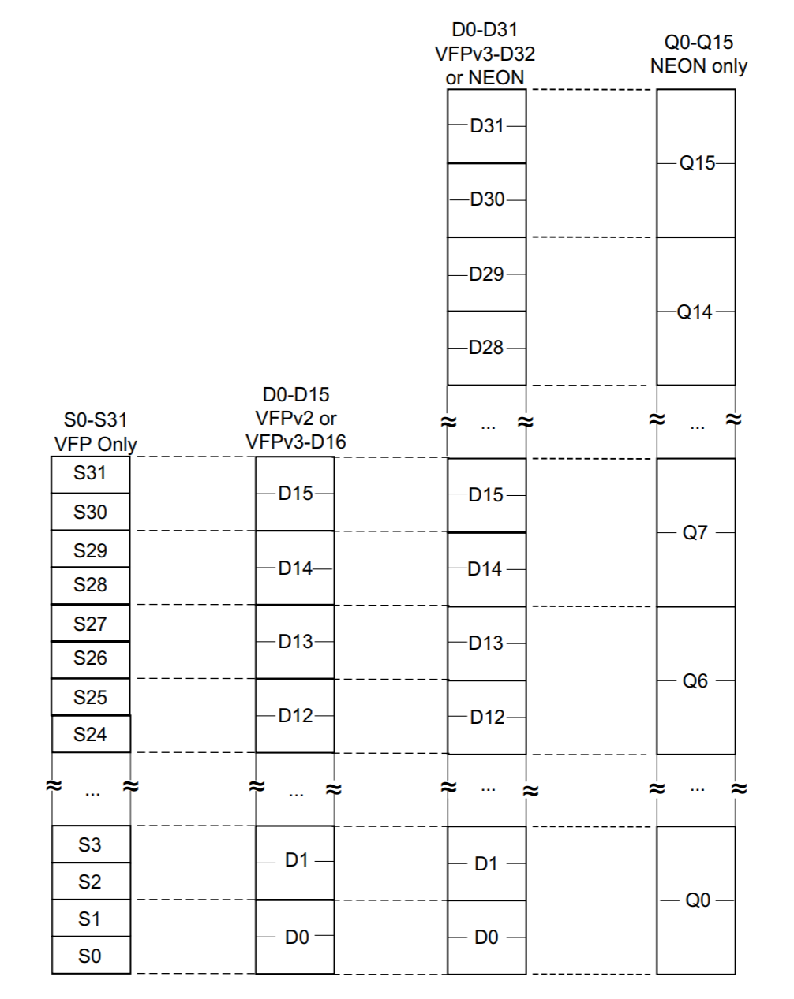
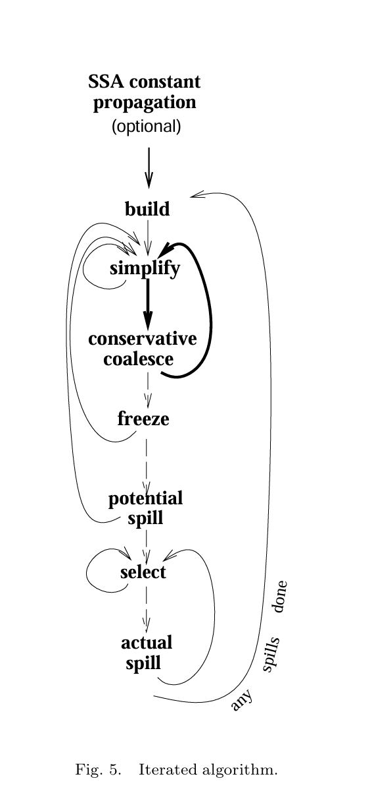

ps: 写些东西证明自己还活着

## 前言
##### &emsp;&emsp;&emsp;4月25日华子的比赛章程把Arm赛道的目的机器的架构改了, 从ArmV7改成ArmV8, 也即从要求编译A32模式更改为要求编译A64模式代码<br>
##### &emsp;&emsp;&emsp;实际上这个行为很难评价, 从2020年有这个比赛开始Arm赛道的章程就几乎从没变过, 导致当年看起来比较新的工具链(如gcc 7.9.0的链接器)已经远远过时了, 旧的工具链可以允许位置有关代码使用, 即`-fno-PIC`<br>
##### &emsp;&emsp;&emsp; A32的性能优化实际上也有瓶颈, 例如ArmV7能够进行SIMD运算, 但受制于浮点协处理器的寄存器的使用规则以及A32不够用的寄存器数量, 导致实现SIMD的难度较大, 所以一直没人做, 通用寄存器的数量一样捉襟见肘, 即使是编码相对合理的performance测例也存在较多的spill<br>
###### &emsp;&emsp;&emsp;还有就是这个板子的问题(赛灵思的那个板子), Cortex-A53是ArmV8早期的一个芯片, 以至于这个芯片现在淘宝咸鱼上几乎绝迹, 外网上上千一块. 这个板子不至于让比赛的难度上升太快, 也比较适合做SIMD, 毕竟都把SIMD写到章程上了, 还限制了多线程, 说明今年的热点就是做向量化的优化, 毕竟再不做出改变, 幽州飞天大学就要在这方面一家独大了

## 寄存器组和调用规约
##### &emsp;&emsp;&emsp;寄存器分配首先需要了解寄存器组
|架构|通用寄存器|单精度浮点|双精度浮点|4字向量寄存器|
|:---:|:---:|:---:|:---:|:---:|
|A32|r0-r15|s0-s31|d0-d31|q0-q16|
|A64|X0-X30, SP, PC|s0-s31|d0-d31|q0-q31|
##### &emsp;&emsp;&emsp;看起来类似, 实际上完全不一样<br>
#### &emsp;A32模式
##### &emsp;&emsp;&emsp;A32下, caller-save为`r0-r3 + r12(ip) + s0-s15`, 把过程间寄存器`ip`也算作caller-save, 方便简化规约, 剩下的是callee-save(如果传参只有int32和单精度浮点数)<br>&emsp;&emsp;&emsp;关于浮点寄存器, 这里需要上一张陈年老图

##### &emsp;&emsp;&emsp;以Neon为例(实际上和图上有出入, 书写汇编时可以用`s<>`寄存器), 相邻并且对齐的两个`s<>`寄存器是一个`d<>`的不同视图, 相邻并且对齐的两个`d<>`是`q<>`的视图, 这种空间占有方式提高了利用率, 但是不利于SIMD, 一方面是寄存器本身不够, 需要同时给单精度, 双精度和4字向量使用, 并且双精度和向量有对齐需求, 寄存器分配时很难保证同一时间空间中, 分配出寄存器尽量的对齐(即尚有空间时不跨越`Q<>`边界分配)<br>
#### &emsp;A64模式
##### &emsp;&emsp;&emsp;A64下, caller-save为`X0-X15 + X16 + X17 + V0-V15`<br>&emsp;&emsp;&emsp;A64下的寄存器视图简单的多, `w<>`即对应的`X<>`的低32位, 并且使用时高位清零; `s<>`, `d<>`是`V<>`的低32位和低64位, `q<>`是对应`V<>`的别名<br>
##### &emsp;&emsp;&emsp;`V<>`和`q<>`是同样的空间, 但是不同的用途, 事实上, 根据个人的观察, `q<>`的访问内存和写入内存更方便, 能够使用`基址 + 偏移`的寻址方式, 而`V<>`能够精细地指示需要执行的向量操作

## 图着色算法(注意事项)
##### &emsp;&emsp;&emsp;这里使用的是`Iterated Register Coalescing`的寄存器分配算法, 选他是因为内置了`Register Coalescing`, 这样就不用自己在做一次寄存器合并, 除此之外, `Register Coalescing`对于`phiEli`产生的冗余copy指令也有不错的消除效果

#####  &emsp;&emsp;&emsp;这个算法的原理, 说实话没什么好看的, 两个赛道现在都是64位都不缺寄存器用的情况下, 图着色解决冲突的效果并不比线性扫描明显特别多(所以有些买椟还珠的意思), 文章末尾的伪代码实际上更有价值<br>
#### &emsp;程序入口和准备工作
##### &emsp;&emsp;&emsp;`procedure`调用`function`, 其中`Main`这个`procedure`为整个程序的入口, 递归执行, 不过也可以改成循环<br>
##### &emsp;&emsp;&emsp;在进行`Main`之前, 需要先准备三样东西:
&emsp;&emsp;&emsp;- `initial`待着色的结点, 就是operands
&emsp;&emsp;&emsp;-`precolors`预着色的操作数, 比如用于传参的寄存器
&emsp;&emsp;&emsp;-`liveinfo`活跃信息, 其实只需要每个blk的livein和liveout, 不必精细到每个instruction的livein, liveout
#### &emsp;需要Coalese的Move的定义
##### &emsp;&emsp;&emsp;关于`move`的定义, 可以是MIR中设计的类似汇编作用的`mov`(并且`src`和`dst`均为寄存器), 用于legalize; 或者是插入的copy语句, 如将ISA寄存器(作为参数或者返回值)拷贝到VReg寄存器以保证语义正确; 当然还有Phi消除的产生的copy
#####  &emsp;&emsp;&emsp;举例如下LLVM IR
```
define dso_local i32 @func(i32 noundef %0, i32 noundef %1){
    ...
}

define dso_local i32 @main(){
    ...
    %114514 = call i32 @func(i32 noundef %114, i32 noundef %514)
    ...
}
```
##### &emsp;&emsp;&emsp;为了确保传参和返回的正确性, 非常建议设计`copy`语句, 并且进行如下处理
```
func:
    %0 = copy $w0
    %1 = copy $w1
    ...

main:
    ...
    $w0 = copy %114
    $w1 = copy %514
    bl func
    %114514 = copy $w0
    ...
```
##### &emsp;&emsp;&emsp;如果愿意或者有需求, 可以根据 `sre op` 和 `dst op` 是VReg或者是ISAReg进行分类, 也就是共四种更细分的copy

##### &emsp;&emsp;&emsp;注意论文中的一个笔误, 在` procedure Combine(u,v)`的第七行, 出现了`nodeMoves`, 但这个变量根本没有被声明, 经过本人实验以及参考往年参赛队的图着色算法, `nodeMoves`应该是`moveList`, 即与一个operand相关的move语句的集合

#### &emsp;启发式算法
##### &emsp;&emsp;&emsp;由于图着色本身是一个NP不完全问题, 所以在论文的基础上, 有几处需要进行启发式算法
&emsp;&emsp;&emsp;-`Simplify`, `Coalesce`, `Freeze`三处`procedure`的首部, 从集合(Operand集或者Instruction集)获取一个元素进行处理, 根据在A32的测试, 设置合理的启发式元素获取算法确实可以减少spill, 但是效果不很明显
&emsp;&emsp;&emsp;-`SelectSpill`第二处启发式, 这里的最低要求是不要将之前溢出得到的用于stage的虚拟寄存器再次溢出, 否则没完没了; 在此之上, 可以设置对于寄存器溢出的偏好, 比如计算Operands的liveIntervalLength, 尽量不溢出基地址或者循环不变量; 不过根据经验, 这里什么都不干也能过
```
procedure SelectSpill()
    let m ∈ spillWorklist selected using favorite heuristic
    Note: avoid choosing nodes that are the tiny live ranges
    resulting from the fetches of previously spilled registers

    spillWorklist := spillWorklist \{m}
    simplifyWorklist := simplifyWorklist ∪{m}
    FreezeMoves(m)
``` 
#### &emsp;如何处理Multiple Register Bank
##### &emsp;&emsp;&emsp;不同的Register Bank的分配可以分批进行. 如果是A32后端, 需要进行`Spill to spr`的优化, 那么`spr`在`gpr`之前分配. 除此之外做好隔离即可.
#### &emsp;调用规约处理
##### &emsp;&emsp;&emsp;也就是处理`callee-save`和`caller-save`的方法
&emsp;&emsp;&emsp;-`callee-save`: 两种方案
&emsp;&emsp;&emsp;&emsp;&emsp;&emsp;1. 虎书方案: 在函数的开头和结尾插入mov或者copy语句, 实现语义上的stage; 如果该stage多余, 会被`register coalesce`合并, 如果寄存器压力大, 会被spill
```
foo:
    %stage_1 = copy $r4
    %stage_2 = copy $r5
    %stage_3 = copy $r6
    ...
    ...
    $r4 = copy %stage_1
    $r5 = copy %stage_2
    $r6 = copy %stage_3

    ; 你猜为什么用A32示例
```
&emsp;&emsp;&emsp;&emsp;&emsp;&emsp;2. 白痴方案(我的方案): 着色时直接记录寄存器分配情况, 然后在Prologue和Epilogue在栈上保存和恢复

## 代码(点进来就是来找这个的?🤣)
##### &emsp;&emsp;&emsp;代码包装为一个Implement的Class, 组织逻辑是`procedure + function + tools`, `tools`的部分需要根据MIR的结构自行完成, `MIROperand_p`, `MIRFunction`等需要更换

```c++

class RegisterAllocImpl {
public:
    using OperSet = std::set<MIROperand_p>;
    using WorkList = std::set<MIROperand_p>;
    using Nodes = std::set<MIROperand_p>;
    using Moves = std::set<MIRInst_p>;

    struct Edge {
        MIROperand_p u, v;
        bool operator==(const Edge &anthor) const;
    };

    struct EdgeHash {
        std::size_t operator()(const Edge &_edge) const {
            return std::hash<std::size_t>()(static_cast<std::size_t>(reinterpret_cast<uintptr_t>(_edge.v.get())) ^
                                            static_cast<std::size_t>(reinterpret_cast<uintptr_t>(_edge.u.get())));
        }
    };

public:
    virtual void impl(MIRFunction &, FAM &);
    RegisterAllocImpl() = default;
    virtual ~RegisterAllocImpl() = default;

protected:
    MIRFunction *mfunc;

    OperSet precolored;
    OperSet initial;

    WorkList simplifyWorkList;
    WorkList freezeWorkList;
    WorkList spillWorkList;

    Nodes coalescedNodes;
    Nodes spilledNodes;
    Nodes coloredNodes;

    // Operands wait to be colored
    std::vector<MIROperand_p> selectStack;

    Moves coalescedMoves;
    Moves constrainedMoves;
    Moves frozenMoves;
    Moves worklistMoves;
    Moves activeMoves;

    // others
    std::unordered_set<Edge, EdgeHash> adjSet;
    std::map<MIROperand_p, OperSet> adjList;
    std::map<MIROperand_p, unsigned int> degree; // precolored will be initialize with -1
    std::map<MIROperand_p, Moves> moveList;
    std::map<MIROperand_p, MIROperand_p> alias;
    // color
    unsigned int K = Config::MIR_new::CORE_REGISTER_MAX_NUM;

protected:
    /// procedures
    void Main(FAM &);
    void Build();
    void MkWorkList();
    void AddEdge(const MIROperand_p &, const MIROperand_p &);
    void Simplify();
    void DecrementDegree(const MIROperand_p &);
    void EnableMoves(const Nodes &);
    void Coalesce();
    void AddWorkList(const MIROperand_p &);
    void Combine(const MIROperand_p &, const MIROperand_p &);
    void Freeze();
    void FreezeMoves(const MIROperand_p &);
    void SelectSpill();
    virtual void AssignColors();

    void ReWriteProgram();

protected:
    /// function
    Nodes Adjacent(const MIROperand_p &);
    Moves NodeMoves(const MIROperand_p &);
    bool MoveRelated(const MIROperand_p &);

    bool OK(const MIROperand_p &t, const MIROperand_p &r); // 合并precolored的启发式算法
    bool Conservative(const Nodes &);                      // Briggs 开发的合并启发式算法
    MIROperand_p GetAlias(MIROperand_p);                   

protected:
    /// tools
    void clearall();

    std::set<int> colors;

    bool isInitialed;

    Liveness liveinfo;

    virtual bool isMoveInstruction(const MIRInst_p &);

    virtual Nodes getUse(const MIRInst_p &);
    virtual Nodes getDef(const MIRInst_p &);

    template <typename Cx, typename Cy> void addBySet(Cx &victim, const Cy &set) {
        static_assert(std::is_same_v<typename Cx::value_type, typename Cy::value_type>,
                      "Cx Cy element types must be identical");

        for (const auto &ptr : set) {
            victim.insert(ptr);
        }
    }
    template <typename Cx, typename Cy> void delBySet(Cx &victim, const Cy &set) {
        static_assert(std::is_same_v<typename Cx::value_type, typename Cy::value_type>,
                      "Cx Cy element types must be identical");

        for (const auto &ptr : set) {
            victim.erase(ptr);
        }
    }

    template <typename T, typename... Tsets> std::set<T> getUnion(Tsets... sets) {
        std::set<T> union_set;
        (union_set.insert(sets.begin(), sets.end()), ...);
        return union_set;
    }

    template <typename T, typename... Tsets> std::set<T> getExclude(std::set<T> victim, Tsets... sets) {
        auto exclude_set = std::move(victim);

        auto lambda = [&exclude_set](const auto &set) -> void {
            for (const auto &t : set) {
                exclude_set.erase(t);
            }
        };

        (lambda(sets), ...);
        return exclude_set;
    }

    MIROperand_p heuristicSpill();

    virtual Nodes spill(const MIROperand_p &);

    unsigned int spilltimes = 0;
};
```
##### &emsp;&emsp;&emsp;对于不同的Register Bank, 直接继承该Class并重写几个虚函数即可<br>
##### &emsp;&emsp;&emsp;有几个工程细节需要注意:
&emsp;&emsp;&emsp;- 1. 为了保证编译结果唯一, 第一: 不要引入随机算法; 第二: 要遍历的容器别是hash实现
&emsp;&emsp;&emsp;- 2. `initial`集, 我选择在首次进入`Build()`时, 遍历Instrctions获取, 可以被放在别的地方
&emsp;&emsp;&emsp;- 3. 容器记得Clear
&emsp;&emsp;&emsp;- 4. 示例寄存器使用的是A64 CoreRegister
&emsp;&emsp;&emsp;- 5. tools和`AssignColor`自己去实现
&emsp;&emsp;&emsp;- 6. `impl`是Class的实际入口
&emsp;&emsp;&emsp;- 7. 由于本人很菜, 所以这个实现并非是运行性能最佳的, 该代码存在的意义就是不用对照论文一句一句翻译

```c++
void RegisterAllocImpl::Main(FAM &fam) {
    
    Build();
    MkWorkList();

    while (!simplifyWorkList.empty() || !worklistMoves.empty() || !freezeWorkList.empty() || !spillWorkList.empty()) {
        if (!simplifyWorkList.empty()) {
            Simplify();
        } else if (!worklistMoves.empty()) {
            Coalesce();
        } else if (!freezeWorkList.empty()) {
            Freeze();
        } else if (!spillWorkList.empty()) {
            SelectSpill();
        }
    }

    AssignColors();

    if (!spilledNodes.empty()) {
        ReWriteProgram();

        Main(fam);
    }
}

void RegisterAllocImpl::AddEdge(const MIROperand_p &u, const MIROperand_p &v) {
    Edge edge{u, v};

    if (u != v && adjSet.find(edge) == adjSet.end()) {
        adjSet.insert(std::move(edge));

        if (precolored.find(u) == precolored.end()) {
            adjList[u].insert(v);
            ++degree[u];
        }

        if (precolored.find(v) == precolored.end()) {
            adjList[v].insert(u);
            ++degree[v];
        }
    }
}

void RegisterAllocImpl::Build() {
    ///@note MkInitial
    if (!isInitialed) {

        for (const auto &blk : mfunc->blks()) {
            for (const auto &inst : blk->Insts()) {

                const auto &use = getUse(inst);
                const auto &def = getDef(inst);

                for (const auto &n : getUnion<MIROperand_p>(def, use)) {
                    if (n->isISA()) {
                        precolored.insert(n);
                        degree[n] = -1; // degree of precolored assign as very large
                    } else if (n->isVReg()) {
                        initial.insert(n);
                    }
                }
            }
        }
    }
    isInitialed = true;

    for (const auto &blk : mfunc->blks()) {

        auto live = liveinfo.liveOut[blk];
        const auto &insts = blk->Insts();

        for (auto inst_it = insts.rbegin(); inst_it != insts.rend(); ++inst_it) {
            const auto &inst = *inst_it;

            const auto &use = getUse(inst);
            const auto &def = getDef(inst);

            if (isMoveInstruction(inst)) {
                delBySet(live, use);

                for (const auto &n : getUnion<MIROperand_p>(def, use)) {
                    addBySet(moveList[n], Moves{inst});
                }

                addBySet(worklistMoves, Moves{inst});
            }

            addBySet(live, def);

            for (const auto &d : def) {
                for (const auto &l : live) {
                    AddEdge(l, d);
                }
            }

            delBySet(live, def);
            addBySet(live, use);
        }
    }
}

void RegisterAllocImpl::MkWorkList() {
    for (auto it = initial.begin(); it != initial.end();) {
        const auto n = *it;

        if (degree[n] >= K) {
            addBySet(spillWorkList, WorkList{n});
        } else if (MoveRelated(n)) {
            addBySet(freezeWorkList, WorkList{n});
        } else {
            addBySet(simplifyWorkList, WorkList{n});
        }

        it = std::next(it);
        delBySet(initial, WorkList{n});
    }
}

void RegisterAllocImpl::Simplify() {

    auto it = simplifyWorkList.begin();

    const auto n = *it;

    simplifyWorkList.erase(it);

    selectStack.emplace_back(n);

    for (const auto &m : Adjacent(n)) {
        DecrementDegree(m);
    }
}

void RegisterAllocImpl::DecrementDegree(const MIROperand_p &m) {
    auto d = degree[m];

    --degree[m];

    if (d == K) {
        EnableMoves(getUnion<MIROperand_p>(Nodes{m}, Adjacent(m)));
        delBySet(spillWorkList, WorkList{m});

        if (MoveRelated(m)) {
            addBySet(freezeWorkList, WorkList{m});
        } else {
            addBySet(simplifyWorkList, WorkList{m});
        }
    }
}

void RegisterAllocImpl::EnableMoves(const Nodes &nodes) {
    for (const auto &n : nodes) {
        for (const auto &m : NodeMoves(n)) {
            if (activeMoves.find(m) != activeMoves.end()) {
                delBySet(activeMoves, Moves{m});
                addBySet(worklistMoves, Moves{m});
            }
        }
    }
}

void RegisterAllocImpl::Coalesce() {

    auto it = worklistMoves.begin();

    auto m = *it;
    worklistMoves.erase(m);

    auto x = *(getDef(m).begin());
    auto y = *(getUse(m).begin());

    auto x_a = GetAlias(x);
    auto y_a = GetAlias(y);

    Edge edge{nullptr, nullptr};
    if (precolored.find(y_a) != precolored.end()) {
        edge.u = y_a, edge.v = x_a;
    } else {
        edge.u = x_a, edge.v = y_a;
    }

    auto &u = edge.u;
    auto &v = edge.v;
    if (u == v) {
        addBySet(coalescedMoves, Moves{m});
        AddWorkList(u);
    } else if (precolored.find(v) != precolored.end() || adjSet.find(edge) != adjSet.end()) {
        addBySet(constrainedMoves, Moves{m});
        AddWorkList(u);
        AddWorkList(v);
    }
    ///@note 将论文的一个if-else拆成了两个
    else if (precolored.find(u) != precolored.end()) {
        ///@note George check

        bool flag = true;
        for (const auto &t : Adjacent(v)) {
            if (!OK(t, u)) {
                flag = false;
                break;
            }
        }

        if (flag) {
            goto __Combine_try;
        } else {
            goto __Combine_giveup;
        }

    } else if (precolored.find(u) == precolored.end() &&
               Conservative(getUnion<MIROperand_p>(Adjacent(u), Adjacent(v)))) {
    ///@note Briggs check
    __Combine_try:
        addBySet(coalescedMoves, Moves{m});
        Combine(u, v);
        AddWorkList(u);
    } else {
    __Combine_giveup:
        addBySet(activeMoves, Moves{m});
    }
}

void RegisterAllocImpl::AddWorkList(const MIROperand_p &u) {
    if (precolored.find(u) == precolored.end() && !MoveRelated(u) && degree[u] < K) {
        delBySet(freezeWorkList, WorkList{u});
        addBySet(simplifyWorkList, WorkList{u});
    }
}

void RegisterAllocImpl::Combine(const MIROperand_p &u, const MIROperand_p &v) {
    if (freezeWorkList.find(v) != freezeWorkList.end()) {
        delBySet(freezeWorkList, WorkList{v});
    } else {
        delBySet(spillWorkList, WorkList{v});
    }

    addBySet(coalescedNodes, Nodes{v});
    alias[v] = u;

    ///@note nodeMoves[u] := nodeMoves[u] ∪ nodeMoves[v]
    ///@note 有充分的理由认为论文写错了, 因为根本没有声明nodeMoves
    ///@note 应该是moveList
    addBySet(moveList[u], moveList[v]);

    for (const auto &t : Adjacent(v)) {
        AddEdge(t, u);
        DecrementDegree(t);
    }

    if (degree[u] >= K && freezeWorkList.find(u) != freezeWorkList.end()) {
        delBySet(freezeWorkList, WorkList{u});
        addBySet(spillWorkList, WorkList{u});
    }
}

void RegisterAllocImpl::Freeze() {

    auto it = freezeWorkList.begin();

    auto u = *it;

    delBySet(freezeWorkList, WorkList{u});

    addBySet(simplifyWorkList, WorkList{u});

    FreezeMoves(u);
}

void RegisterAllocImpl::FreezeMoves(const MIROperand_p &u) {
    for (const auto &m : NodeMoves(u)) {
        auto u = *(getUse(m).begin());
        auto v = *(getDef(m).begin());

        if (activeMoves.find(m) != activeMoves.end())
            delBySet(activeMoves, Moves{m});
        else
            delBySet(worklistMoves, Moves{m});

        addBySet(frozenMoves, Moves{m});

        if (NodeMoves(v).empty() && degree[v] < K) {
            delBySet(freezeWorkList, WorkList{v});
            addBySet(simplifyWorkList, WorkList{v});
        }
    }
}

void RegisterAllocImpl::SelectSpill() {
    auto m = heuristicSpill();

    delBySet(spillWorkList, WorkList{m});
    addBySet(simplifyWorkList, WorkList{m});

    FreezeMoves(m);
}
```

##### &emsp;&emsp;&emsp;